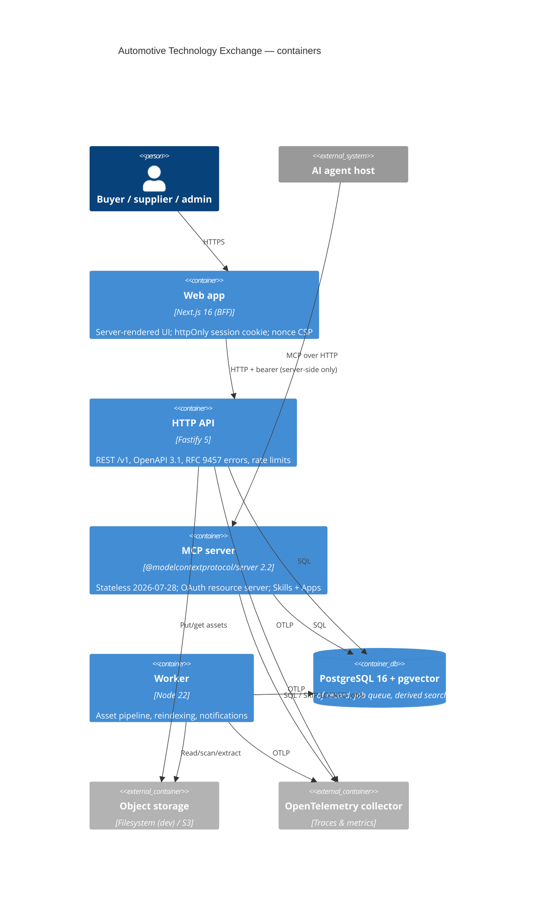

# C4 — Containers

```mermaid
C4Container
  title Automotive Technology Exchange — containers
  Person(user, "Buyer / supplier / admin")
  System_Ext(agent, "AI agent host")
  Container(web, "Web app", "Next.js 16 (BFF)", "Server-rendered UI; httpOnly session cookie; nonce CSP")
  Container(api, "HTTP API", "Fastify 5", "REST /v1, OpenAPI 3.1, RFC 9457 errors, rate limits")
  Container(mcp, "MCP server", "@modelcontextprotocol/server 2.2", "Stateless 2026-07-28; OAuth resource server; Skills + Apps")
  Container(worker, "Worker", "Node 22", "Asset pipeline, reindexing, notifications")
  ContainerDb(pg, "PostgreSQL 16 + pgvector", "System of record, job queue, derived search index")
  Container_Ext(store, "Object storage", "Filesystem (dev) / S3")
  Container_Ext(otel, "OpenTelemetry collector", "Traces & metrics")

  Rel(user, web, "HTTPS")
  Rel(web, api, "HTTP + bearer (server-side only)")
  Rel(agent, mcp, "MCP over HTTP")
  Rel(api, pg, "SQL")
  Rel(mcp, pg, "SQL")
  Rel(worker, pg, "SQL / SKIP LOCKED jobs")
  Rel(api, store, "Put/get assets")
  Rel(worker, store, "Read/scan/extract")
  Rel(api, otel, "OTLP")
  Rel(mcp, otel, "OTLP")
  Rel(worker, otel, "OTLP")
```

All three Node services share the same application layer through `packages/runtime`; there is no service-to-service traffic other than the web BFF calling the API.
