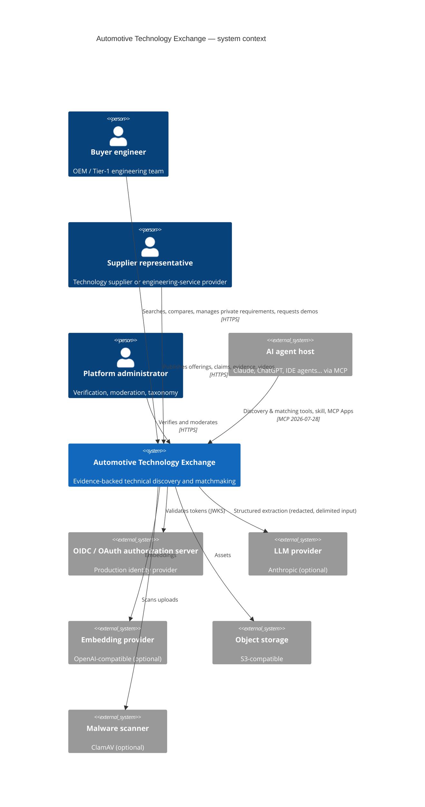

# C4 — System context

Trust boundaries: everything supplier-authored (profiles, claims, documents, transcripts, video metadata) is untrusted data; buyer requirements are tenant-private; tokens are audience-bound per resource.
